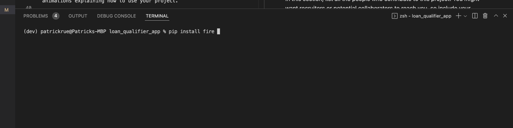
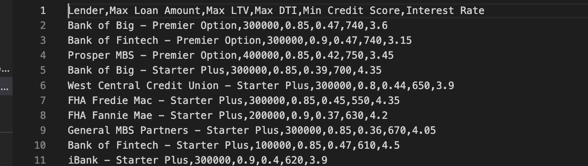

# Project Title

This app returns a csv file of list of banks that can afford to offer a user a loan amount, given user information, like credit score, loan amount, monthly incoe of the user etc.

---

## Technologies
To run this app, user need a mac OS or windows OS, that can run python3 applications. Other python applications, libraries and frameworks used in this project include:
1. sys 
2. csv 
3. questionary
4. pathlib
5. fire 
See requirements.txt for list of all libaries used.

---

## Installation Guide

To install libaries and frameworks need to run the application. 
Create a git repository
On your terminal follow the following steps:
    
    cd <location of file>
    conda create -n <evn_name> python=3.7 
    conda activate <evn_name>
    pip install fire 
    pip install questionary
    git clone <link to repo>
    python3 app.py

Follow the prompts and enter the correct values and file path when asked. 

## Usage

This application generate a file, of the list of banks, max amount of loan they can offer, mininum credit score and interest rate they willing to offer the user. Given the users credit score, monthly income, current loans, value of house and how much they want to borrow. 

## Contributors

This project is incollaboration with the Columbia University FinTech 2022 bootcamp team, and capabilties extended by Patrick R. For questions and comment kindly contact Patrick via email on pruejoma@gmail.com.

---

## License

When you share a project on a repository, especially a public one, it's important to choose the right license to specify what others can and can't with your source code and files. Use this section to include the license you want to use.
