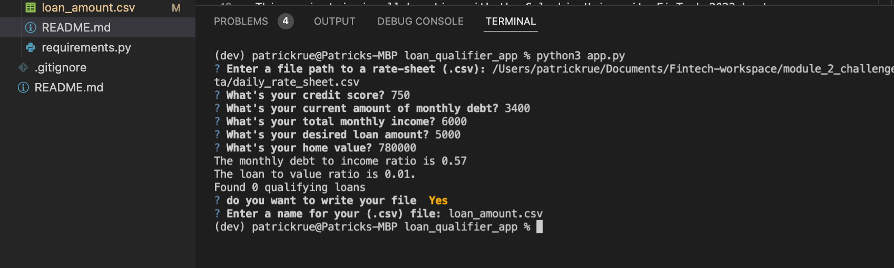

# LOAN QUALIFIER APPLICATION

## Table of Contents

1. Project Motivation
2. About the Application
3. Techologies Used 
4. Installation Guide
5. File Descriptions
6. How to Use
7. Contributors
8. License

## Project Motivation

This project is in completion of the Columbia University FinTech 2022 bootcamp module two weekly challenge exercise. 

---

## About the Application

This app returns a csv file of a list of banks that can afford to offer a user a loan amount, given the users provided informations, like credit score, loan amount, monthly income etc.

---

## Technologies Used
The application is written in python programming langauge. Users need a device that can run python3 applications. 
Other python applications, libraries and frameworks used in this project include:
1. sys 
2. csv 
3. questionary
4. pathlib
5. fire 
See requirements.txt for list of all libaries used.

---

## Installation Guide

Follow steps in the snippet below to install libaries and frameworks and to run the application. 
In your terminal do the following:
    
    cd <location of file>
    conda create -n <evn_name> python=3.7 
    conda activate <evn_name>
    git clone <link to repo>
    pip install -r requirement.txt
    cd loan_qualifier_app 
    python3 app.py

Follow the prompts and enter the correct values and file path when asked. 
See example in image below.

---

## File Descriptions 
There are three folders and four files in the Starter_Code/loan_qualifier_app subfolder
1. Data folder:
    - daily_rate_sheet.csv
2. Images
    - bank_list.jpg
    - how_to_run_app.jpg
3. Qualifier
   - filter 
      - credit_score.py
      - debt_to_income.py
      - loan_to_value.py
      - max_loan_size.py
   - utils
      - calculators.py
      - fileio.py
      
4. app.py file (to run the app)
5. loan_amount.csv (created after the app was ran)
6. README.md
7. requirements.txt

## How to Use

Given a users credit score, monthly income, current loans, value of house and how much they want to borrow, this application generates a file of the list of banks, and the max amount they can offer the user.   

## Contributors

This project is in collaboration with the Columbia University FinTech 2022 bootcamp team, and extended by Patrick R. For questions and comments kindly contact Patrick via email on pruejoma@gmail.com

---

## License

This project is in completion of the Columbia University FinTech 2022 bootcamp module two weekly challenge exercise. It should not be copied and used for commercial purpose without the authorization of the admin on this repo. For futher information please contact Patrick via email on  pruejoma@gmail.com
